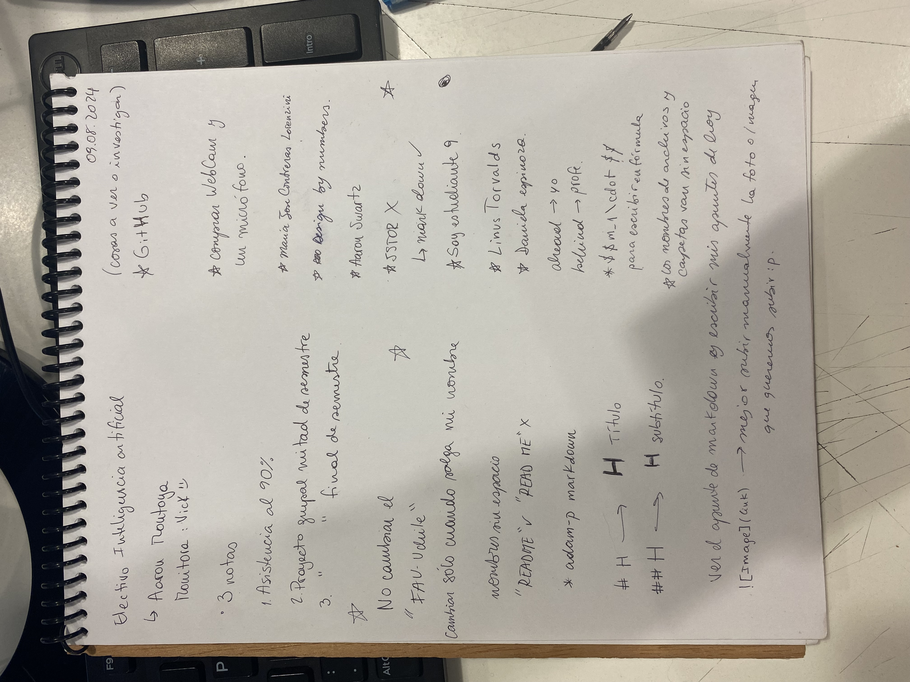

# primera clase :D

### Electivo Inteligencia Artificial

Me llamo Marcela Osorio, soy de tercer año de la carrera de Diseño Industrial, me metí al electivo porque me dijeron cosas buenas del profesor Aaron y creo que la inteligencia artificial es algo que se usa mucho hoy en día, y se usará aún más en el futuro.

El profe es simpático, te hace estar atento a las cosas que dice y lo que uno tiene que hacer, para ser primera clase me dejó bastante intrigada y con ganas de seguir acá y ver que es lo que puedo lograr en este mundo de la programación.

Ví en Markdown Chearsheet cómo enfatizar o poner de distintas maneras las palabras para destacarlas como entre *asteriscos* o **dobles asteriscos** o entre _guión bajo_ o **_mezclando ambas_**,, o simplemente ~~tachando algo~~, se parece a como se escribe en whatsapp.

Aquí están mis apuntes, me gusta hacerlo en papel, así aprendo mejor, cuando escribo las cosas las memorizo, así me sirve más en lo personal.

Eso es lo que hice y aprendí hoy. Gracias por la clase!!
